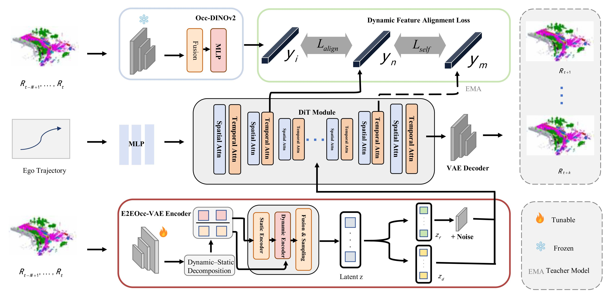
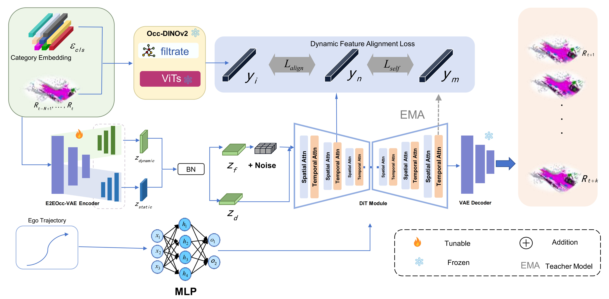
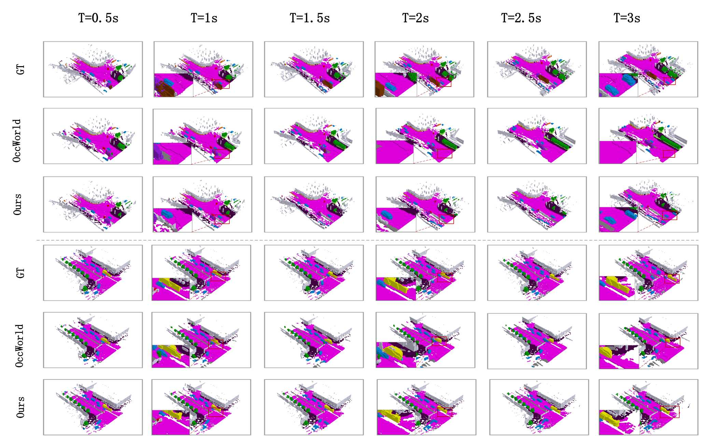

# E2E-OCC

This repository provides visual demonstrations and supplementary materials for the paper:

**E2EOcc: End-to-End 4D Occupancy World Modeling with Unified Spatiotemporal Diffusion**

**Code will be released upon acceptance.**

  

---

## 📣 Overview
We propose an integrated training scheme that jointly optimizes occupancy feature extraction and latent spatiotemporal modeling via diffusion, mitigating the information bottleneck of conventional VAE-based methods and enhancing the model’s performance:

- **We design a novel feature extraction network tailored for dynamic scene modeling, which adapts to 4D discrete voxel representations and improves feature retention in sparse environments.** 
- **We introduce a diffusion training paradigm augmented by dynamic distillation to balance performance and efficiency, accelerating convergence and boosting feature robustness.**

---

## 🏛️ Framework Overview

  

**Figure:** Overview of our language-guided diffusion planner.  
The architecture fuses multi-modal perception (RGB, LiDAR), vehicle state, learned semantic cues, and agent-aware priors to guide diffusion-based trajectory generation.

---

## 🚗 Qualitative Results

### 1. Comparison with Baselines

  

**Figure:** Comparison with representative baseline planners.  
Our method produces more consistent, scene-aware, and drivable trajectories (red = prediction, green = ground truth).

---

## 📊 Quantitative Summary

Below is a sample table (replace values with your own or substitute with a figure such as `assets/table_results.png`):

要在 GitHub README 中以**表格形式展示第二张图的内容**，可以使用 Markdown 表格语法。以下是适配 GitHub 显示的 Markdown 表格代码：

| Method    | Input  | \multicolumn{5}{c}{MIOU(\%)↑} | \multicolumn{5}{c}{IOU(\%)↑} |
|-----------|--------|---------|------|-------|------|------|---------|------|-------|------|------|
|           |        | Recon.  | 1s   | 2s    | 3s   | Avg. | Recon.  | 1s   | 2s    | 3s   | Avg. |
| OccWorld-F| Camera | 20.09   | 8.03 | 6.91  | 3.54 | 6.16 | 35.61   | 23.62| 18.13 | 15.22| 18.99|
| OccWorld-O| Occ    | 66.38   | 25.78| 15.14 | 10.51| 17.14| 62.29   | 34.63| 25.07 | 20.18| 26.63|
| OccLLaMA-F| Camera | 37.38   | 10.34| 8.66  | 6.98 | 8.66 | 38.92   | 25.81| 23.19 | 19.47| 22.99|
| OccLLaMA-O| Occ    | 75.20   | 25.05| 19.49 | 15.26| 19.93| 63.76   | 34.56| 28.53 | 20.91| 29.17|
| Ours-F    | Camera | 42.36   | 16.59| 12.71 | 8.29 | 12.53| 41.27   | 29.01| 25.73 | 23.02| 25.92|
| Ours-O    | Occ    | 76.10   | 31.60| 22.45 | 17.88| 23.92| 71.62   | 39.34| 31.77 | 27.01| 32.60|

将这段代码直接粘贴到 GitHub README.md 文件中，即可自动渲染为清晰的表格，与原图的布局和内容完全一致。

---

## 📄 Paper

**Title:** Interpretable and Generalizable Diffusion Planning via Vision-Language Guidance and Agent-Aware Trajectory Initialization  
**Authors:** Ran Bu, Junjie Zhang, Qirong Liu, Liang Song, Zhifei Zhao, Yanzi Miao  
**Status:** Under Review  
**Preprint:** Available in project resources.

---

## 📬 Contact

If you have any questions or need additional materials:

**Email:** your_email@domain.com

---

## 🔒 Code Availability

The full implementation is currently under review and will be released once the paper is accepted.

---

If you'd like, I can also:

- Export figures from your PDF into the `assets/` folder
- Produce a dark-mode or banner-enhanced README
- Generate an OpenGraph banner for GitHub previews

Just tell me which task to do next.
